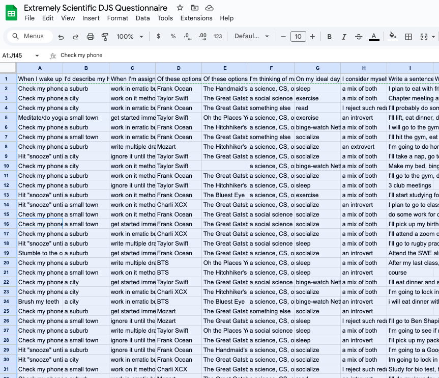
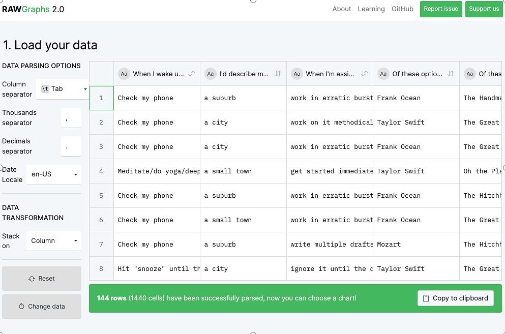
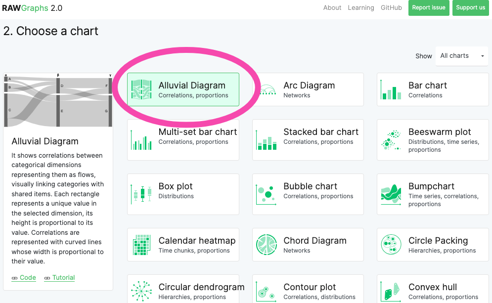
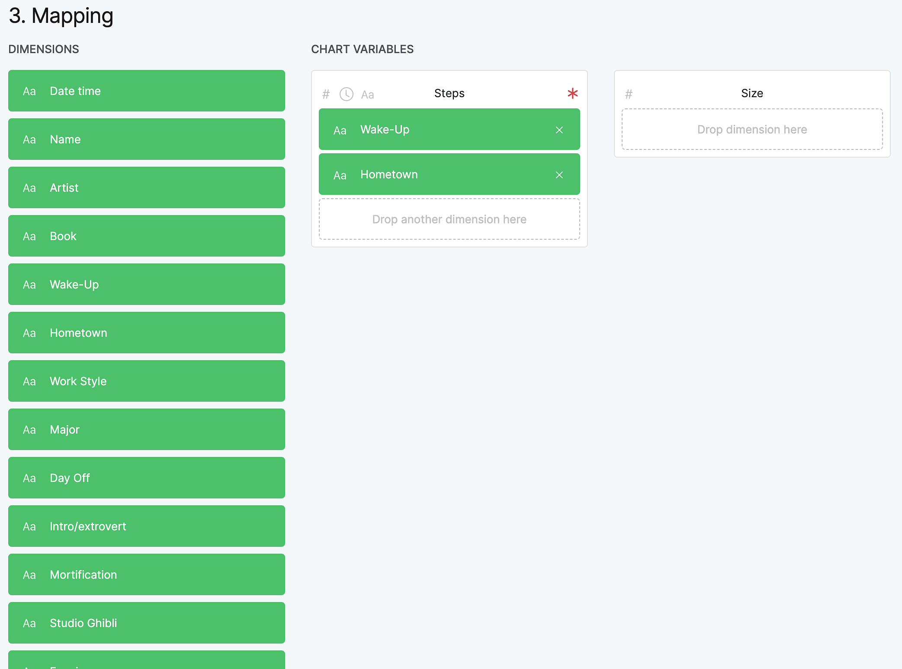
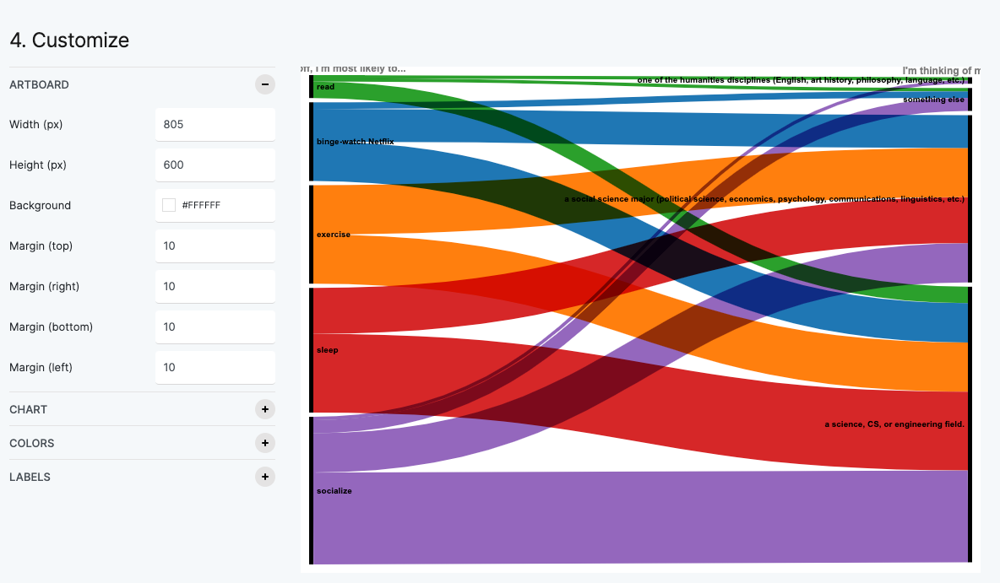

# Make a quick diagram with RAW

Let's see if we can find correlations in our dataset by building a chart. To do that, we'll use a web-based tool called [RAWGraphs](about:blank).

You can find our dataset [here](https://docs.google.com/spreadsheets/d/1CYA-IUSRj-1rLpq0L2SZ3yQxPt8Xv5yx26L63re4-2U/edit?usp=sharing).

We'll copy all of our questionnaire data, paste it into RAW, and build an alluvial diagram. If you feel comfortable doing that immediately, feel free to skip this tutorial and get right to it! But if you want step by step instructions, please read on.

### 1. Copy all of our questionnaire data
First, click [here](https://docs.google.com/spreadsheets/d/17G_79dK2zPwZsQr33PJDCphKz9XK5fx4HTqmygjad7s/edit?usp=sharing) to open our dataset.

To select all of the data in our spreadsheet, press **⌘** **a** (**control a** on a PC).

Then, to copy all of the data, press **⌘** **c** (**control c** on a PC).

### 2. Open RAWGraphs
Go to [www.rawgraphs.io](about:blank) and click on 

**Use it now!**

RAWGraphs is a web-based tool for visualizing CSV data.

### 3. Paste your data
Place your cursor in the empty box and press **command v** (**control v** on a PC) to paste in all the data you copied in the first step. Once you do that, your screen should look like the accompanying image.

### 4. Choose a chart
Scroll down to see the list of charts RAWGraphs makes available. As you can see, there are a lot of charts! But they won't all work well with the kind of data we have.

Let's start with the **Alluvial Diagram*.***If it's already selected, move on to the next step.

### 5. Build your chart
Scroll down to the **Mapping** section.

Let's tell RAW which columns to include in our chart. Drag some of the rectangles on the left onto the **Steps** box in the middle. (They should all work, except the last two.) Start with two or three. You don't need to put anything in the box labeled **Size**.

### 6. Admire your chart!
Scroll down to see your alluvial diagram! You can play with the colors by clicking on the **Colors** section.

Try scrolling back up, changing the categories, and making a new chart! 

Feel free to play with the other chart types, too. You'll quickly notice that some of them work and some of them don't. For example, if you choose **Pie**, you'll see a message telling you that "You can't map strings on Arcs." (A "string" is a set of characters.) The message means that for this type of chart, RAW needs numbers, not text. So to make a pie chart, you'll need to first summarize the data by adding up all the unique values. But don't worry about that now!

